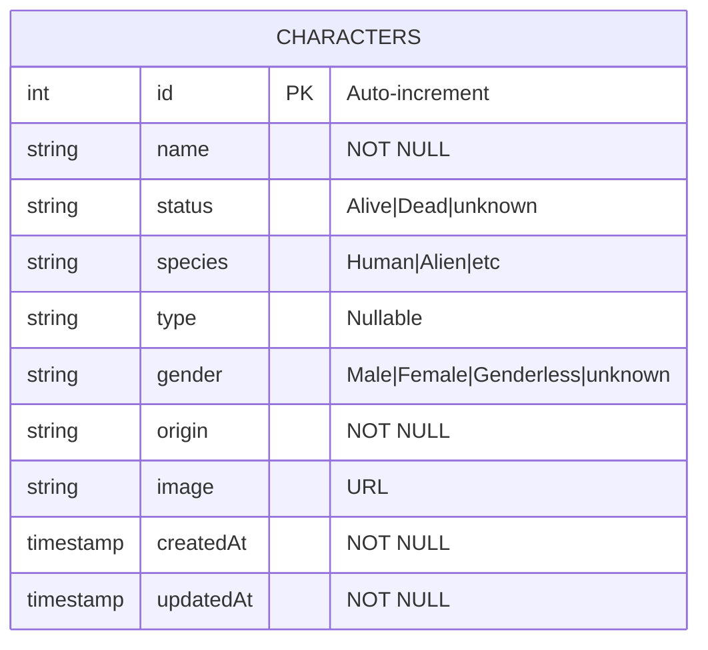

# 📊 Diagrama ERD - Rick & Morty Characters API

## Entity Relationship Diagram

```
┌─────────────────────────────────────────────────────────────┐
│                        CHARACTERS                            │
├─────────────────────────────────────────────────────────────┤
│  PK  │ id          │ INTEGER      │ NOT NULL, AUTO_INCREMENT│
├──────┼─────────────┼──────────────┼─────────────────────────┤
│      │ name        │ VARCHAR(255) │ NOT NULL                │
│      │ status      │ VARCHAR(50)  │ NOT NULL                │
│      │ species     │ VARCHAR(100) │ NOT NULL                │
│      │ type        │ VARCHAR(100) │ NULLABLE                │
│      │ gender      │ VARCHAR(50)  │ NOT NULL                │
│      │ origin      │ VARCHAR(255) │ NOT NULL                │
│      │ image       │ VARCHAR(500) │ NOT NULL                │
│      │ createdAt   │ TIMESTAMP    │ NOT NULL                │
│      │ updatedAt   │ TIMESTAMP    │ NOT NULL                │
└─────────────────────────────────────────────────────────────┘
```

## Descripción de Campos

| Campo | Tipo | Restricciones | Descripción |
|-------|------|---------------|-------------|
| `id` | INTEGER | PK, NOT NULL, AUTO_INCREMENT | Identificador único del personaje |
| `name` | VARCHAR(255) | NOT NULL | Nombre completo del personaje |
| `status` | VARCHAR(50) | NOT NULL | Estado vital: "Alive", "Dead", "unknown" |
| `species` | VARCHAR(100) | NOT NULL | Especie: "Human", "Alien", etc. |
| `type` | VARCHAR(100) | NULLABLE | Subtipo específico (puede ser vacío) |
| `gender` | VARCHAR(50) | NOT NULL | Género: "Male", "Female", "Genderless", "unknown" |
| `origin` | VARCHAR(255) | NOT NULL | Planeta/dimensión de origen |
| `image` | VARCHAR(500) | NOT NULL | URL de la imagen del personaje |
| `createdAt` | TIMESTAMP | NOT NULL | Fecha de creación del registro |
| `updatedAt` | TIMESTAMP | NOT NULL | Fecha de última actualización |

## Diagrama Visual (Mermaid)



## Valores Posibles

### Status
- `Alive` - Personaje vivo
- `Dead` - Personaje muerto
- `unknown` - Estado desconocido

### Gender
- `Male` - Masculino
- `Female` - Femenino
- `Genderless` - Sin género
- `unknown` - Género desconocido

### Species (ejemplos)
- `Human` - Humano
- `Alien` - Alienígena
- `Humanoid` - Humanoide
- `Robot` - Robot
- `Animal` - Animal
- `Mythological Creature` - Criatura mitológica
- `Poopybutthole` - Poopybutthole
- `Cronenberg` - Cronenberg

## Índices

| Nombre | Columnas | Tipo |
|--------|----------|------|
| PRIMARY | id | PRIMARY KEY |

## Notas de Diseño

1. **Tabla única**: El modelo actual es simple con una sola entidad `Characters`, ya que la API de Rick & Morty nos provee datos desnormalizados.

2. **Campo `origin`**: Se almacena como string en lugar de FK a una tabla de locaciones para mantener simplicidad y porque solo se usa para display/filtrado.

3. **Campo `type`**: Es nullable porque muchos personajes no tienen un subtipo específico.

4. **Timestamps**: Sequelize maneja automáticamente `createdAt` y `updatedAt`.

## Posibles Extensiones Futuras

Si se quisiera expandir el modelo, se podrían crear las siguientes tablas adicionales:

```
┌──────────────┐       ┌──────────────┐       ┌──────────────┐
│   LOCATIONS  │       │  CHARACTERS  │       │   EPISODES   │
├──────────────┤       ├──────────────┤       ├──────────────┤
│ id           │◄──────│ origin_id FK │       │ id           │
│ name         │       │ location_id  │──────►│ name         │
│ type         │       │ ...          │       │ air_date     │
│ dimension    │       └──────────────┘       │ episode_code │
└──────────────┘              │               └──────────────┘
                              │                      ▲
                              │                      │
                              └──────────────────────┘
                           CHARACTER_EPISODES (N:M)
```

## SQL de Creación (PostgreSQL)

```sql
CREATE TABLE IF NOT EXISTS "Characters" (
    "id" SERIAL PRIMARY KEY,
    "name" VARCHAR(255) NOT NULL,
    "status" VARCHAR(50) NOT NULL,
    "species" VARCHAR(100) NOT NULL,
    "type" VARCHAR(100),
    "gender" VARCHAR(50) NOT NULL,
    "origin" VARCHAR(255) NOT NULL,
    "image" VARCHAR(500) NOT NULL,
    "createdAt" TIMESTAMP WITH TIME ZONE NOT NULL,
    "updatedAt" TIMESTAMP WITH TIME ZONE NOT NULL
);
```

---
